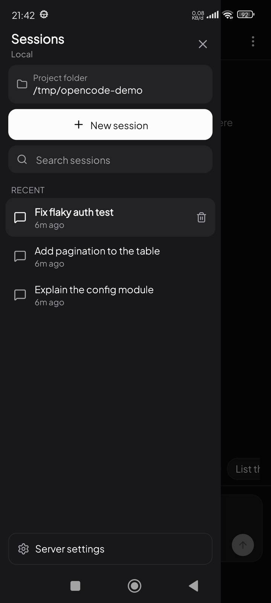
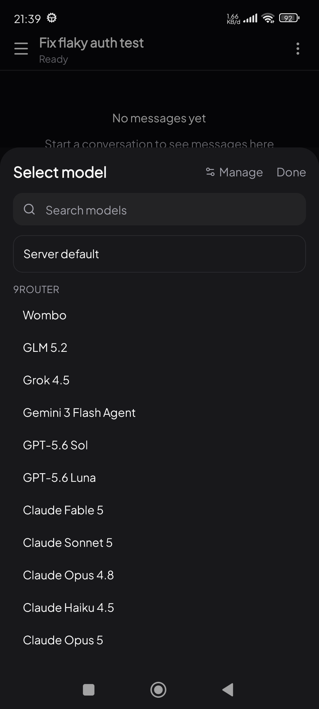
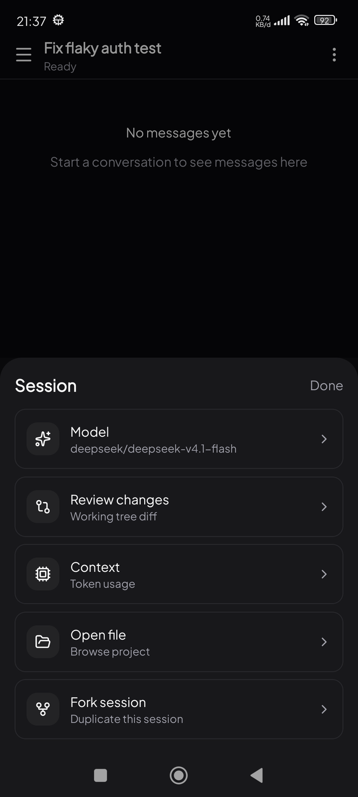
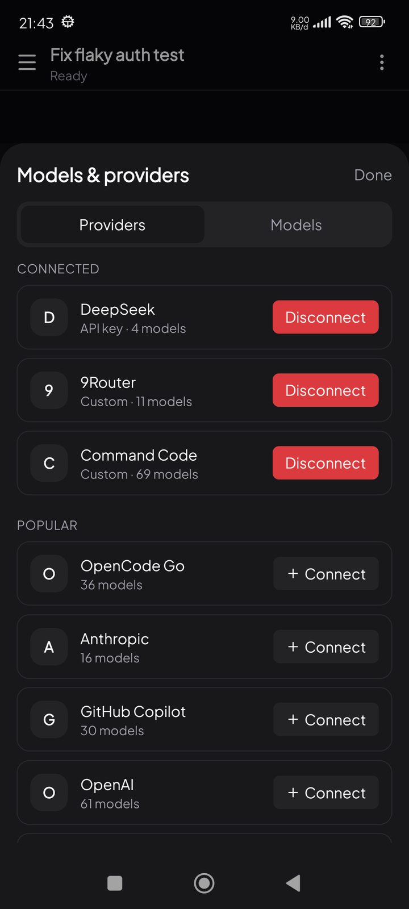
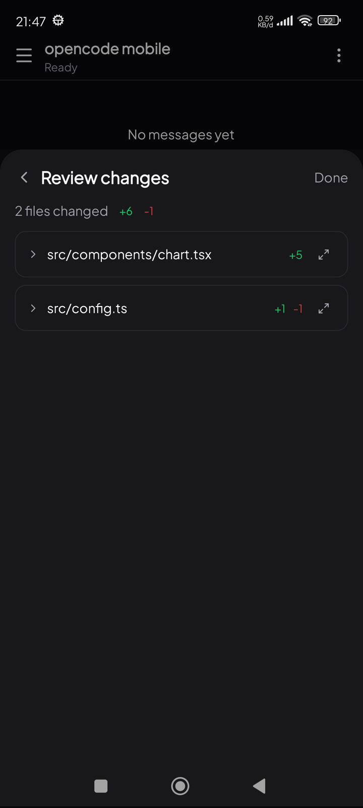
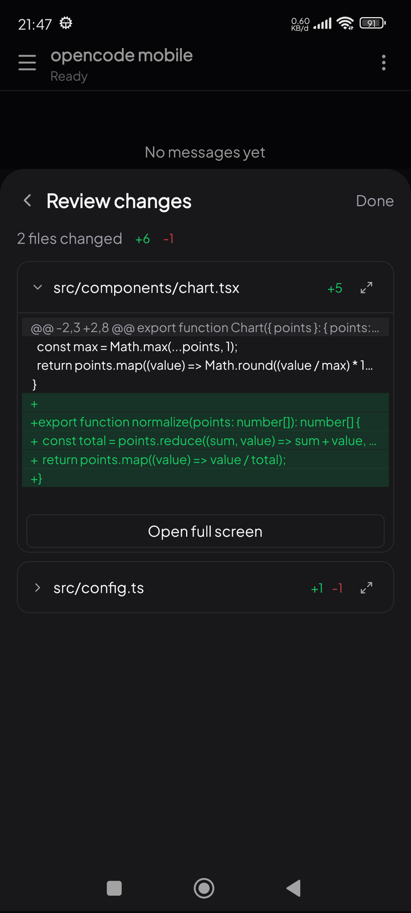
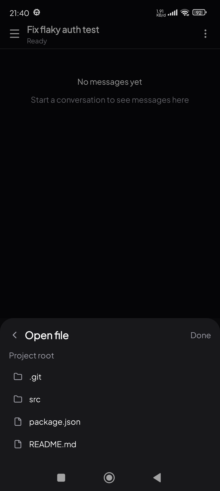
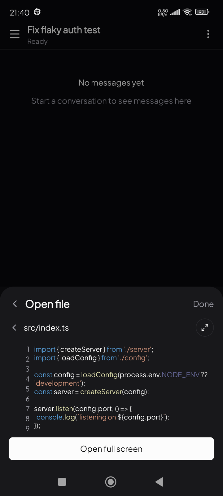
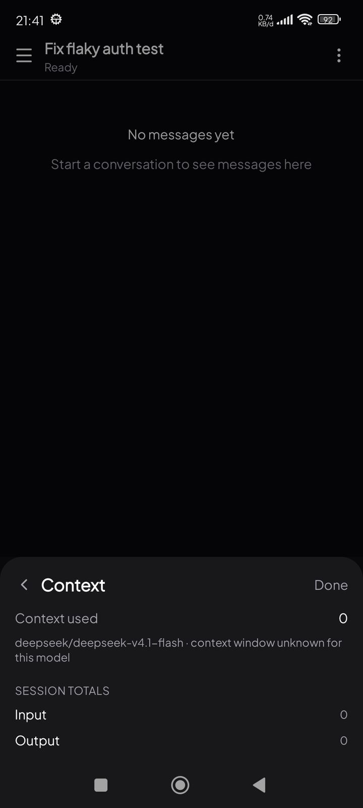
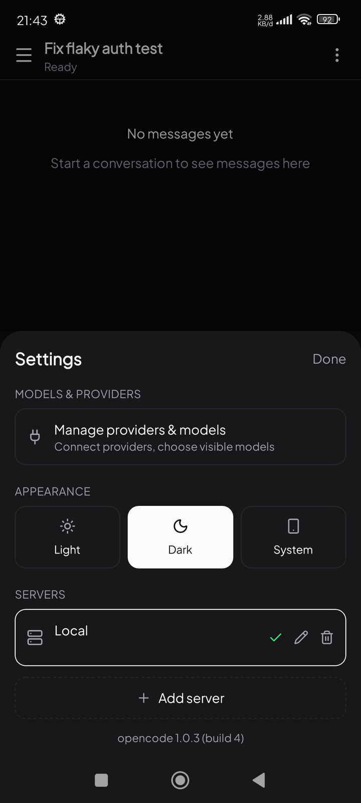

# Opencode Android client

Unofficial Android client for an [opencode](https://opencode.ai) server, built with Expo SDK 57 and React Native. It connects to a running `opencode serve` instance over HTTP + SSE and gives you the full session experience — streaming chat, tool calls, provider/model management, diff review, and file browsing — from your phone.

Android only. There is no iOS or web target.

## Screenshots

|  |  |
| :---: | :---: |
|  |  |
| Sessions — browse, search, switch project folder | Model picker — each provider's models and variants |
|  |  |
| Session menu — model, diff review, context, files | Providers — connect by API key or OAuth |
|  |  |
| Review changes — working-tree diff, per file | Diff — additions and deletions |
|  |  |
| Open file — browse the project tree | Files render with line numbers and highlighting |
|  |  |
| Context — token usage and breakdown | Settings — servers, theme and build version |

## Features

**Chat**
- Streaming assistant responses over SSE, with reasoning, tool calls, plans, tasks, and checkpoints rendered as structured parts
- Markdown responses with syntax-highlighted, selectable code blocks
- Attachments: photos, camera captures, and arbitrary documents
- Session list in a native drawer, with pagination
- Abort in-flight generations

**Sessions and workspace**
- **Model picker** with per-provider grouping and model variants
- **Review changes** — the working-tree diff (`vcs/diff`), per file, with a preview in-sheet and a full-screen virtualized diff viewer
- **Context** — token usage against the model's context window, with a per-category breakdown
- **Open file** — browse the project tree and read files with syntax highlighting

**Providers and models**
- Connect providers by API key or OAuth (both `code` and `auto` flows), plus custom OpenAI-compatible endpoints
- Disconnect providers, and show/hide individual models from the picker

**App**
- Light / dark / system theming, including status bar and navigation bar
- Portrait and landscape
- Multiple server configurations, switchable at runtime

## Requirements

- Node.js 20+
- A JDK 17 installation and the Android SDK (`JAVA_HOME` and `ANDROID_HOME` must be set)
- An Android device or emulator
- A reachable opencode server (`opencode serve`)

**Expo Go is not supported.** The app depends on native modules that are not part of the Expo Go runtime, so you need a development build or a release APK.

## Setup

```bash
npm install
npx expo prebuild --platform android   # generates ./android (gitignored)
```

Point the app at your server by setting environment variables before building. Both are optional — they only seed the default server entry, and everything can be changed later in the app's settings.

```bash
EXPO_PUBLIC_OPENCODE_URL=http://192.168.1.10:4097
EXPO_PUBLIC_OPENCODE_DIRECTORY=/home/you/projects/my-app
```

`EXPO_PUBLIC_OPENCODE_DIRECTORY` is the project directory the server should operate on; it is passed as the `directory` query parameter on requests.

## Running

**Development build** — installs a debug APK and connects to Metro:

```bash
npm run android
```

On subsequent runs, just start the bundler:

```bash
npm start
```

If the device talks to Metro over USB, forward the port:

```bash
adb reverse tcp:8081 tcp:8081
```

**Release APK** — a standalone build with the JS bundle embedded, which is the faster path for iterating on a physical device once the native side is stable:

```bash
APP_VARIANT=release npx expo prebuild --platform android
cd android
EXPO_PUBLIC_OPENCODE_URL="http://192.168.1.10:4097" \
  ./gradlew assembleRelease -PreactNativeArchitectures=arm64-v8a
```

The APK lands at `android/app/build/outputs/apk/release/app-release.apk`. Install it with `adb install -r <apk>`. Restrict `reactNativeArchitectures` to your device's ABI as above to keep build times down.

`APP_VARIANT=release` switches the package id to `com.opencode.expo.release` (app name "opencode") so the release installs **alongside** the dev-client build (`com.opencode.expo`) instead of overwriting it. Re-run plain `npx expo prebuild --platform android` afterwards to switch the local `android/` project back to dev.

Note that by default this release is signed with the debug keystore. Supply a real keystore before distributing anything publicly.

## Cutting a release

Pushing a `release-*` tag on main triggers the [Release APK workflow](.github/workflows/release-apk.yml), which typechecks, builds the standalone arm64 APK, and publishes it as a GitHub Release asset:

```bash
git tag release-v1.0.0 main && git push origin release-v1.0.0
```

`APP_VERSION_CODE` comes from the CI run number, so every published APK installs as an update over the previous one. The optional `EXPO_PUBLIC_OPENCODE_URL` repo variable is baked in as the default server at build time (it can still be changed in Settings afterwards).

## Scripts

| Script | Purpose |
| --- | --- |
| `npm start` | Metro bundler for a development build |
| `npm run android` | Build, install, and launch the debug app |
| `npm run prebuild` | Regenerate the native `android` project |
| `npm run build:apk` | Prebuild + `assembleDebug` |
| `npm run typecheck` | `tsc --noEmit` |

## Cleartext HTTP

opencode servers usually run over plain HTTP on a LAN, which Android blocks by default in release builds. The generated project includes `android/app/src/main/res/xml/network_security_config.xml` with `cleartextTrafficPermitted="true"`, referenced from the manifest.

The `android` directory is gitignored and regenerated by prebuild. The local config plugin `plugins/with-android-manifest-tweaks.js` (wired in `app.config.js`) regenerates the network security config, references it from the manifest, and re-applies the other hand-maintained manifest tweaks (landscape `screenOrientation`, predictive-back opt-out) on every prebuild — so `android/` can be regenerated safely at any time.

## Project structure

```
App.tsx                     Providers: gesture handler, keyboard, safe area,
                            settings, HeroUI, react-query
src/
  screens/ChatScreen.tsx    Main screen; owns the drawer, sheets, and viewers
  chat/
    opencode.ts             HTTP client and API types
    use-opencode-chat.ts    SSE stream, message pagination, sending
    use-workspace.ts        vcs/diff, file listing, file content
    use-opencode-provider-management.ts
                            Provider catalog, auth, OAuth, global config
    model-visibility.tsx    Per-model show/hide
    settings.tsx            Persisted servers + theme (AsyncStorage)
    context-breakdown.ts    Token usage estimation
    attachments.ts          Image/document picking
  components/
    ai-elements/            Chat primitives (message, reasoning, tool, plan,
                            prompt input, response, code block, ...)
    chat/                   Session panels, drawer, provider and model UI
    ui/                     Buttons, badges, spinner, highlighted code
  hooks/                    Theme colors, keyboard height, controllable state
```

## Notable implementation details

- **Styling** uses [Uniwind](https://github.com/nativewind/uniwind) (Tailwind v4 for React Native) with HeroUI Native semantic tokens — `bg-background`, `text-foreground`, `border-border`, and so on. Prefer these over raw palette classes with `dark:` variants; Uniwind does not deduplicate conflicting utilities.
- **Syntax highlighting** is `prism-react-renderer`, which is pure JS with no DOM dependency. Code blocks render as a single selectable text node so press-and-hold selection spans multiple lines, with line numbers in a separate gutter so they are excluded from copied text.
- **Long content is virtualized.** Rendering every line of a large file or diff as its own view will exhaust memory and hang the UI thread. File and diff viewers use `FlatList` with a fixed row height and `getItemLayout`, and bottom sheets show a capped preview with a "view full" affordance rather than the whole document.
- **Avoid nesting long lists inside the bottom sheet's `ScrollView`.** Nested scroll containers break measurement on Android and clamp rows to the parent's bounds, producing clipped and unscrollable content.
- **The sessions drawer** is React Native's `DrawerLayoutAndroid`, driven imperatively. It opens noticeably faster than a modal-based drawer, but it has no built-in back handling, so a `BackHandler` closes it.

## License

MIT. See [LICENSE](./LICENSE).
