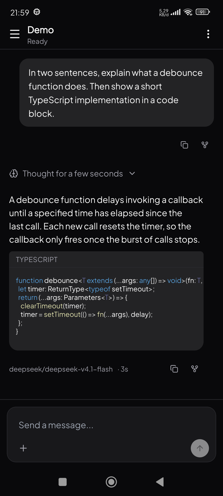
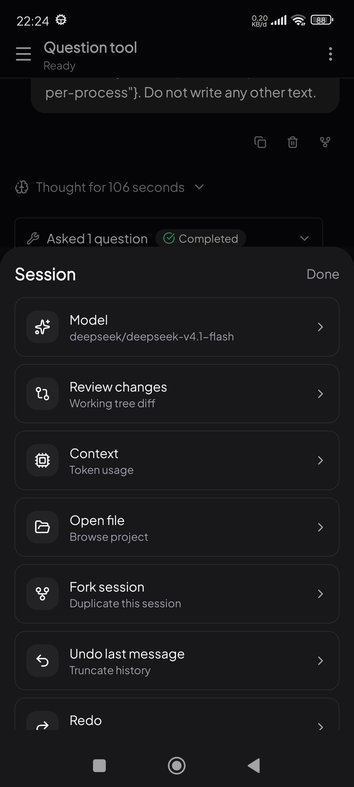
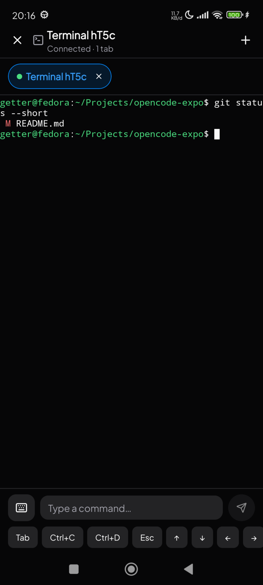
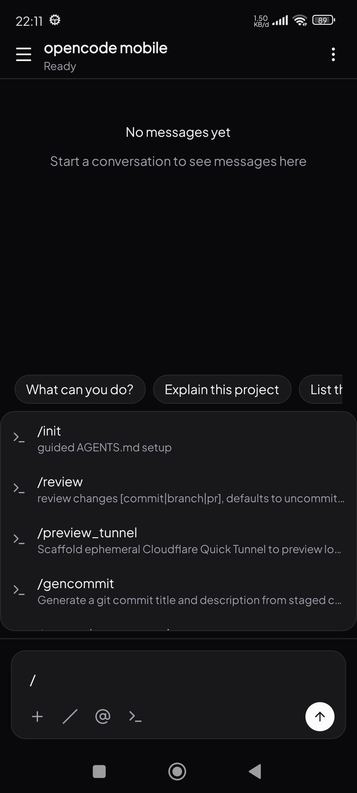
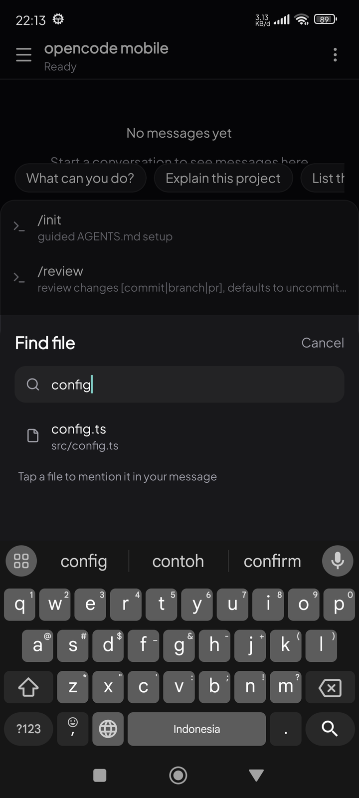
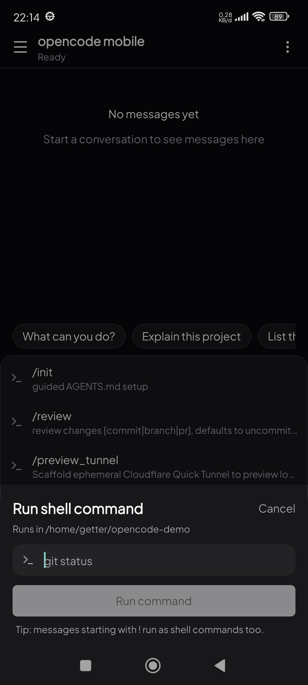
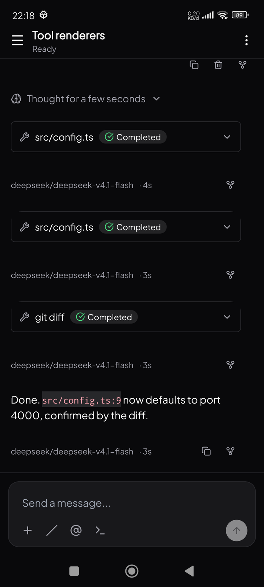
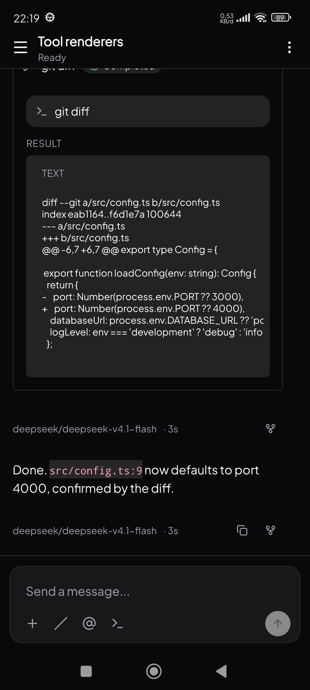
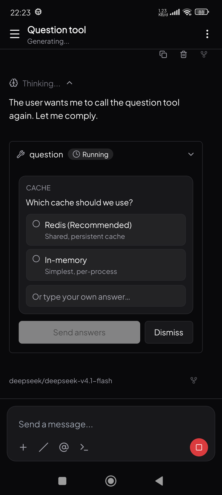
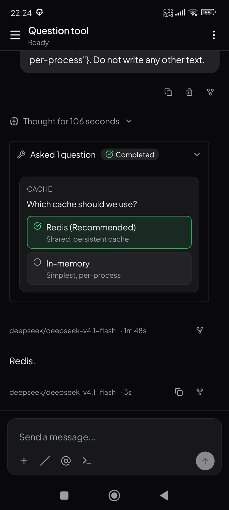

# Opencode Android client

Unofficial Android client for an [opencode](https://opencode.ai) server, built with Expo SDK 57 and React Native. It connects to a running `opencode serve` instance over HTTP + SSE and gives you the full session experience — streaming chat, tool calls with approvals, provider/model management, diff review, file browsing, and a multi-tab PTY terminal — from your phone.

Android only. There is no iOS or web target.

## Screenshots

<p align="center">
  
</p>

|  |  |
| :---: | :---: |
|  |  |
| Sessions — browse, search, rename, switch project folder | Model picker — each provider's models and variants |
|  |  |
| Session actions — model, diff, context, fork, undo/redo, share, summarize | Providers — connect by API key or OAuth |
|  |  |
| Review changes — working-tree diff, per file | Diff — additions and deletions |
|  |  |
| Open file — browse the project tree | Files render with line numbers and highlighting |
|  |  |
| Context — token usage and breakdown | Settings — servers, theme and build version |
|  |  |
| Terminal — live PTY tabs, command input and control keys |  |

### Composer and tools

|  |  |
| :---: | :---: |
|  |  |
| Slash — commands from the server, typed or from the button | `@` — fuzzy-search a file to mention |
|  |  |
| Shell — run a command with `!` or the terminal button | Tool calls — read, edit and bash, not raw JSON |
|  |  |
| Expanded tool — result with syntax-aware output | Question tool — tap an option or type an answer |
|  |  |
| Answered — the chosen option is recorded |  |

## Features

**Chat**
- Streaming assistant responses over SSE, rendered as structured parts: reasoning, tool calls, plans, tasks, checkpoints, questions, and permission prompts
- Markdown responses with syntax-highlighted, selectable code blocks
- Tool permission requests answered inline (approve/deny); the `question` tool answers itself in-chat
- Shell commands via a leading `!` or the terminal button — output streams back into the chat with the bash tool renderer
- Slash commands from the server (typed or from the button) and `@` fuzzy file mentions
- Attachments: gallery images and arbitrary documents
- Queue messages while a run streams; abort in-flight runs; retry failed messages
- Per-message actions: fork from a message, delete a message

**Sessions and workspace**
- Session drawer with pagination, search, rename, and delete
- New-session folder picker: a project folder the server knows about, or a new absolute path
- Session menu: model, review, context, files, fork, undo/redo, share/unshare, summarize, sub-sessions/parent navigation, and close project (unload workspace)
- **Model picker** with per-provider grouping and model variants
- **Review changes** — the working-tree diff, per file, with a preview in-sheet and a full-screen virtualized diff viewer
- **Context** — token usage against the model's context window, with a per-category breakdown
- **Open file** — browse the project tree and read files with syntax highlighting and download progress

**Terminal**
- Multi-tab PTY terminal backed by the server, over WebSocket with reconnect and scrollback
- Renders through the local `opencode-terminal` Expo module (`modules/terminal-view`), which embeds the Termux terminal emulator; create, switch, and kill tabs

**Providers and models**
- Connect providers by API key or OAuth (both `code` and `auto` flows), plus custom OpenAI-compatible endpoints
- Disconnect providers, and show/hide individual models from the picker

**App**
- Multiple server configurations (URL, basic-auth username/password, project directory), switchable at runtime
- Light / dark / system theming, including status bar and navigation bar
- Portrait and landscape

## Requirements

- Node.js 20+
- A JDK 17 installation and the Android SDK (`JAVA_HOME` and `ANDROID_HOME` must be set)
- An Android device or emulator
- A reachable opencode server (`opencode serve`, default port 4096)

**Expo Go is not supported.** The app depends on native modules (including the local `opencode-terminal` module) that are not part of the Expo Go runtime, so you need a development build or a release APK.

## Setup

```bash
npm install
npx expo prebuild --platform android   # generates ./android (gitignored)
```

Point the app at your server by setting environment variables before building. Both are optional — they only seed the default server entry, and everything (including per-server basic-auth credentials) can be changed later in the app's settings.

```bash
EXPO_PUBLIC_OPENCODE_URL=http://192.168.1.10:4096
EXPO_PUBLIC_OPENCODE_DIRECTORY=/home/you/projects/my-app
```

`EXPO_PUBLIC_OPENCODE_DIRECTORY` is the project directory the server should operate on; it is passed as the `directory` query parameter on requests.

## Running

Iterate on the **expo-dev-client build** (`com.opencode.expo`). Build and install it once:

```bash
npm run android   # expo run:android: builds, installs, and launches the dev client
```

On subsequent runs, just start the bundler, forward the port, and launch explicitly by package (older release APKs also register the `exp+` scheme, so the deep link is otherwise ambiguous):

```bash
npx expo start --dev-client --port 8081
adb reverse tcp:8081 tcp:8081
adb shell am start -a android.intent.action.VIEW \
  -d "exp+opencode-expo://expo-development-client/?url=http%3A%2F%2Flocalhost%3A8081" \
  -p com.opencode.expo
```

Standalone release APKs are built only by CI (see below) — they bundle the JS runtime and install side by side with the dev client under `com.opencode.expo.release`. Do not build the release variant locally.

## Cutting a release

Pushing a `release-*` tag on main triggers the [Release APK workflow](.github/workflows/release-apk.yml), which typechecks, builds the standalone arm64 APK, and publishes it as a GitHub Release asset:

```bash
git tag release-v1.0.0 main && git push origin release-v1.0.0
```

The version name comes from the tag (`release-v1.2.3` → `1.2.3`); the version code comes from the CI run number, so every published APK installs as an update over the previous one. `EXPO_PUBLIC_APP_VERSION`, `EXPO_PUBLIC_APP_VERSION_CODE`, and the optional `EXPO_PUBLIC_OPENCODE_URL` repo variable are passed to the Gradle assemble step — Metro inlines `EXPO_PUBLIC_*` into the JS bundle when it is built there, not during prebuild — and the installed app reports them in the Settings footer (see `src/chat/app-info.ts`). The APK is signed with the debug keystore: fine for personal sideloading, not for Play distribution.

## Scripts

| Script | Purpose |
| --- | --- |
| `npm start` | Metro bundler for the development build (`expo start --dev-client`) |
| `npm run android` | Build, install, and launch the dev-client app (`expo run:android`) |
| `npm run prebuild` | Regenerate the native `android` project |
| `npm run build:apk` | Prebuild + `assembleDebug` (local debug APK) |
| `npm run typecheck` | `tsc --noEmit` — the only automated gate |
| `npm run benchmark` | Render benchmark harness (`scripts/benchmark/`) |
| `npm run benchmark:interaction` | Interaction benchmark harness |
| `npm run test:e2e` | Maestro flows in `.maestro/` |

## Cleartext HTTP

opencode servers usually run over plain HTTP on a LAN, which Android blocks by default in release builds. The generated project includes `android/app/src/main/res/xml/network_security_config.xml` with `cleartextTrafficPermitted="true"`, referenced from the manifest.

The `android` directory is gitignored and regenerated by prebuild. The local config plugin `plugins/with-android-manifest-tweaks.js` (wired in `app.config.js`) regenerates the network security config, references it from the manifest, and re-applies the other hand-maintained manifest tweaks (landscape `screenOrientation`, predictive-back opt-out) on every prebuild — so `android/` can be regenerated safely at any time.

## Project structure

```
App.tsx                     Providers: gesture handler, keyboard, safe area,
                            settings, HeroUI, react-query
src/
  screens/ChatScreen.tsx    Main screen; owns the drawer, sheets, and viewers
  chat/                     Server client + state (opencode.ts, opencode-types.ts,
                            types.ts, chat-state.ts, use-opencode-chat.ts,
                            use-chat-events.ts, use-session-actions.ts,
                            use-workspace.ts, use-opencode-providers.ts,
                            use-opencode-provider-management.ts, use-pty-tabs.ts,
                            model-visibility.tsx, settings.tsx, app-info.ts,
                            context-breakdown.ts, attachments.ts,
                            dismissed-projects.ts, adaptive-render.ts,
                            terminal-text.ts)
  components/
    ai-elements/            Chat primitives (message, reasoning, tool and
                            tool-details, plan, task, checkpoint, confirmation,
                            context, prompt input, response, code block, ...)
    chat/                   Session drawer and panels, model/provider sheets,
                            composer suggestions, shell sheet, terminal screen, ...
    ui/                     Buttons, badges, spinner, dialog, bottom sheet,
                            highlighted code, ...
  hooks/                    Theme colors, keyboard height, controllable state
  lib/                      Classname utils, interaction perf marks
modules/terminal-view       Local Expo module embedding the Termux emulator
plugins/                    with-android-manifest-tweaks.js (prebuild tweaks)
scripts/benchmark           Render + interaction benchmark harnesses
.maestro/                   E2E flows (session menu, panels, shell, providers, ...)
```

## Notable implementation details

- **Async state uses `@tanstack/react-query`** (`useQuery` / `useMutation`) — not manual `useEffect` + `useState` fetching.
- **Server chat flows one way:** SSE events (`/event`) land in `use-opencode-chat.ts`, which maps wire `OpencodePart` → `UIMessagePart` and stores them in per-message state; `MessageItem` dispatches parts to renderers. Assistant tool parts render via `src/components/ai-elements/tool-details.tsx` — new tool renderers go there, wired by a `toolName === 'x'` branch, otherwise they fall back to a raw JSON dump.
- **Styling** uses [Uniwind](https://github.com/nativewind/uniwind) (Tailwind v4 for React Native) with HeroUI Native semantic tokens — `bg-background`, `text-foreground`, `border-border`, and so on. Prefer these over raw palette classes with `dark:` variants; Uniwind does not deduplicate conflicting utilities.
- **Syntax highlighting** is `prism-react-renderer`, which is pure JS with no DOM dependency. Code blocks render as a single selectable text node so press-and-hold selection spans multiple lines, with line numbers in a separate gutter so they are excluded from copied text. `read`/`write`/`edit` tool output picks its language from the file path (`languageForPath`), never a hardcoded `language="text"`.
- **Long content is virtualized.** Rendering every line of a large file or diff as its own view will exhaust memory and hang the UI thread. File and diff viewers use `FlatList` with a fixed row height and `getItemLayout`, and bottom sheets show a capped preview with a "view full" affordance rather than the whole document.
- **Avoid nesting long lists inside the bottom sheet's `ScrollView`.** Nested scroll containers break measurement on Android and clamp rows to the parent's bounds, producing clipped and unscrollable content.
- **The sessions drawer** is React Native's `DrawerLayoutAndroid`, driven imperatively. It opens noticeably faster than a modal-based drawer, but it has no built-in back handling, so a `BackHandler` closes it.

## License

MIT. See [LICENSE](./LICENSE).
